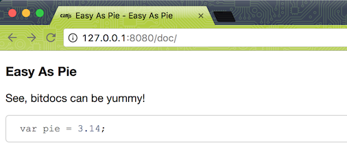
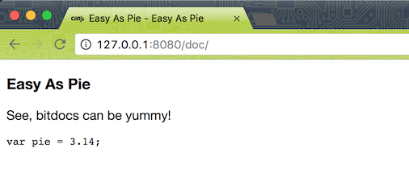

# super-simple-bit-docs

Let this repo serve as an example of the simplest possible implementation of [`bit-docs`](https://github.com/bit-docs/bit-docs).

It can be used by beginners to get started, or as a lowest common denominator for test cases.

## Quick Start

Install the npm dependencies defined in [`package.json`](package.json):

```
npm install
```

### Explanation of `package.json`

First in line, we see `bit-docs` is defined as a `devDependency`. The reason it is a `dev` dependency, and not a regular dependency, is that we will be using `bit-docs` when working on the command-line as a developer. This dependency was added to the project using the command: `npm install --save-dev bit-docs`:

```json
  "devDependencies": {
    "bit-docs": "*"
  },
```

Next in line is the `bit-docs` json, because the `bit-docs` command-line tool looks in the `package.json` of your project for it's configuration:

```json
  "bit-docs": {
```

This configuration defines the plugins `bit-docs` should install and use; for example, `bit-docs-prettify` will enable syntax highlighting of code-snippets in the generated HTML:

```json
    "dependencies": {
      "bit-docs-glob-finder": "*",
      "bit-docs-dev": "*",
      "bit-docs-js": "*",
      "bit-docs-generate-html": "*",
      "bit-docs-prettify": "*"
    },
```

**Note**: All other plugins listed in `dependencies` (`bit-docs-glob-finder`, `bit-docs-dev`, `bit-docs-js`, `bit-docs-generate-html`) are necessary for the core operation of `bit-docs` and therefore should be considered mandatory.

Continuing with the `bit-docs` configuration, you will see the `glob` definition; this tells `bit-docs` where (or where not) to look for files for inclusion in the built documentation: 

```json
    "glob": {
      "pattern": "docs/**/*.{js,md}",
      "ignore": [
        "docs/ignoremepls/**/*"
      ]
    },
```

The `parent` definition specifies which of the documents should be considered the "parent" of all other documents built by `bit-docs`, in this case `easyaspie.md` will become `index.html`:

```json
    "parent": "easyaspie",
    "minifyBuild": false
```

The `bit-docs` command-line tool builds all of it's documentation to a `doc` directory in the root of your project, next to the `package.json`. Finally, the `bit-docs` declaration ends, and that is all you need for a super basic setup!

```json
  }
```

### What's Included

These are the important files:

```
super-simple-bit-docs
├── docs               # This is the directory that the glob pattern is set to search.
└── package.json       # This is specifies the project dependencies and bit-docs configuration.
```

### The Exciting Part: Using `bit-docs` to Build Documentation

To use the bit-docs binary that was installed by `npm install`, run the following command from the root of your cloned repository:

```
./node_modules/bit-docs/bin/bit-docs
```

Easy as pie, `bit-docs` will traverse through the `docs` folder, and generate HTML documentation into `doc` (no `s`). You can preview the results with:

```
npm install -g http-server && http-server
```

Run that command, and then use your web browser to visit <http://127.0.0.1:8080/doc>. You should see the following:



This is the contents of our source markdown "page" located at [`docs/easyaspie.md`](docs/easyaspie.md), generated by `bit-docs` into an HTML website page at `doc/index.html`.

In the generated `doc` directory you will also find a file called `searchMap.json`. This is the meat and potatoes of the `bit-doc` functionality; a generated json object representing the relationship between all of source documentation files, and is what allows the HTML to be generated.

## Things to Try

Try adding and removing the `bit-docs-prettify` plugin to see how things change.

In `package.json`, delete the following line:

```json
      "bit-docs-prettify": "*",
```

Then, regenerate the documentation using the `-f` force flag:

```
./node_modules/bit-docs/bin/bit-docs -f && http-server
```

Now when you visit <http://127.0.0.1:8080/doc>, the code-snippet is no longer "prettified":



## Alpha Software

As a project, `bit-docs` is in the alpha stages, and this repo is setup to use the latest versions of `bit-docs` and related plugins, so if this example repo is breaking, you might have to lock the version numbers down to previous releases in the `package.json`.
